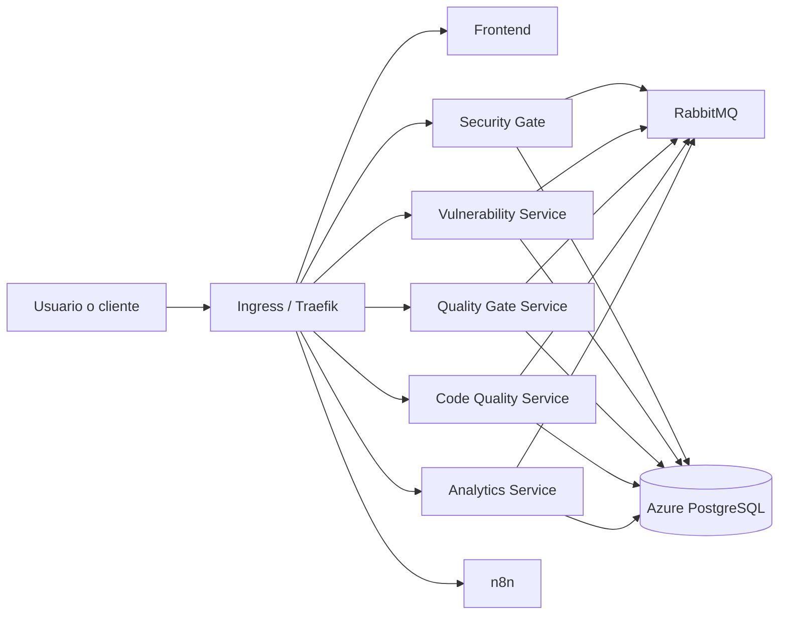
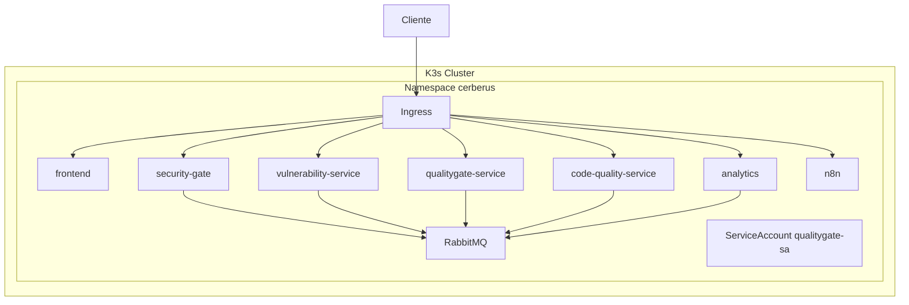
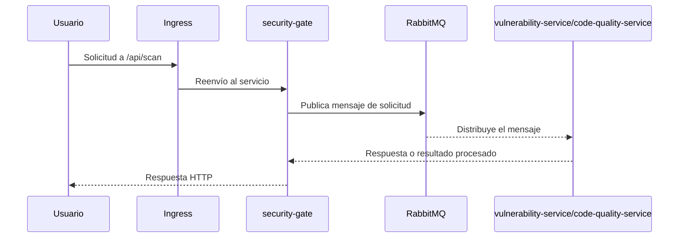

# CERBERUS Kubernetes Platform

## Descripción ejecutiva

Este repositorio contiene la capa de infraestructura y despliegue de la plataforma CERBERUS. No es un proyecto monolítico de aplicación ni un backend/frontend completo; es un conjunto de manifiestos de Kubernetes, configuraciones de infraestructura y un workflow de GitHub Actions orientado a desplegar la plataforma en un cluster K3s.

La arquitectura implementada aquí define cómo se organizan los servicios, cómo se exponen mediante ingress, cómo se integran con RabbitMQ y cómo se inyectan secretos y configuraciones a través de Kubernetes. Su propósito principal es hacer que la plataforma sea desplegable, reproducible y operable en entornos de producción o preproducción sin depender de despliegues manuales directos sobre nodos.

## Problema que resuelve

El problema que aborda este repositorio no es desarrollar la lógica de negocio de cada servicio, sino garantizar que los componentes de CERBERUS puedan:

- ejecutarse de forma consistente en un clúster Kubernetes;
- descubrirse entre sí mediante servicios internos;
- exponerse a través de una ruta única de entrada;
- recibir configuraciones y secretos de forma controlada;
- desplegarse automáticamente desde GitHub Actions;
- escalar y mantener una operación más ordenada que un despliegue manual sobre máquinas.

## Objetivos

- establecer una base de infraestructura como código para CERBERUS;
- separar claramente recursos base, infraestructura y servicios de aplicación;
- permitir despliegues reproducibles sobre K3s;
- usar Kubernetes como capa de orquestación y gestión de estado de los contenedores;
- centralizar la entrada de tráfico mediante ingress;
- desacoplar la configuración de los servicios mediante ConfigMaps y Secrets;
- automatizar despliegue con GitHub Actions.

## Casos de uso

- despliegue inicial de la plataforma en un cluster K3s;
- actualización de servicios individuales sin tocar la infraestructura base;
- exposición de servicios a través de una única entrada HTTP;
- integración con un broker de mensajes RabbitMQ para comunicación asíncrona;
- operación de un flujo de automatización con n8n;
- gestión de permisos específicos para servicios que necesitan interactuar con el control plane de Kubernetes.

---

## Arquitectura general

Este repositorio implementa una arquitectura orientada a servicios sobre Kubernetes. La plataforma está compuesta por varios servicios desplegados como Deployments, un broker de mensajes, un componente de automatización, un ingress y recursos de acceso.

### Visión general



### Decisión de arquitectura

La decisión de modelar la plataforma como un conjunto de servicios desplegados sobre Kubernetes responde a tres necesidades concretas:

1. cada componente debe ser independiente y reemplazable;
2. la plataforma debe soportar múltiples flujos de procesamiento y exposición de API;
3. se requiere un mecanismo de despliegue consistente y repetible.

Kubernetes no se eligió por conveniencia; es la capa que permite administrar ciclo de vida, networking interno, secretos, probes de salud, recursos y reinicios automáticos. Sin esta capa, la operación de la plataforma sería mucho más frágil.

### Diagrama de despliegue



### Qué existe realmente en este repositorio

Este repositorio no contiene el código fuente de los servicios ni sus implementaciones. Lo que sí existe es la infraestructura necesaria para ejecutarlos. Por esa razón, la arquitectura se describe aquí en términos de despliegue, rutas, dependencias externas y contratos de integración observables en los manifiestos.

---

## Tecnologías

| Tecnología | Qué es | Para qué sirve en este proyecto | Por qué fue elegida | Observaciones |
|---|---|---|---|---|
| Kubernetes | Orquestador de contenedores | Ejecutar los servicios de CERBERUS como pods, servicios, deployments e ingress | Permite despliegue reproducible, descubrimiento de servicios, reinicios y gestión del ciclo de vida | Es la capa central del repositorio |
| K3s | Distribución ligera de Kubernetes | Servir como runtime del clúster de despliegue | Menor complejidad operativa que una distribución completa de Kubernetes | Se usa explícitamente en el workflow de GitHub Actions |
| GitHub Actions | Plataforma de CI/CD | Desplegar manifiestos sobre el cluster remoto vía SSH | Automatiza el pipeline de infraestructura | El workflow está definido en .github/workflows |
| Traefik | Ingress Controller | Exponer servicios HTTP desde el clúster | Es el controlador declarado en los annotations del ingress | La ruta de entrada se define en el manifiesto de ingress |
| RabbitMQ | Broker de mensajes | Permitir comunicación asíncrona entre servicios | Se observa un exchange fanout declarado explícitamente | Se usa como middleware de integración |
| n8n | Plataforma de automatización | Ejecutar flujos y automatizaciones | Está desplegada como componente operativo del sistema | Se expone como servicio interno y via NodePort |
| Azure PostgreSQL | Base de datos externa | Proveer persistencia para servicios que requieren datos relacionales | Los manifiestos hacen referencia a secretos de conexión | No existe schema ni migración en este repo |
| GHCR | Registro de imágenes | Almacenar y descargar las imágenes de los servicios | Los deployments hacen pull de imágenes desde ghcr.io | El repo asume que las imágenes ya existen |

### Tecnologías que no aparecen como implementación en este repositorio

- Dockerfiles: no existen en este repositorio.
- docker-compose: no existe.
- código fuente de backend/frontend: no existe.
- pruebas automatizadas: no existen.
- Helm charts: no existen.

---

## Estructura del proyecto

```text
.
├── .github/
│   └── workflows/
│       └── deploy-infrastructure.yml
├── k8s/
│   ├── base/
│   │   ├── cluster-info-configmap.yaml
│   │   ├── namespace.yaml
│   │   ├── configmaps/
│   │   │   └── app-config.yaml
│   │   └── secrets/
│   ├── infrastructure/
│   │   ├── ingress/
│   │   ├── n8n/
│   │   ├── rabbitmq/
│   │   └── rbac/
│   └── services/
│       ├── analytics/
│       ├── code-quality-service/
│       ├── frontend/
│       ├── qualitygate-service/
│       ├── security-gate/
│       └── vulnerability-service/
├── scripts/
└── README.md
```

### Por qué existe cada carpeta

- .github/workflows: contiene la automatización de despliegue. Esta carpeta existe porque la infraestructura se aplica desde un pipeline remoto y no manualmente.
- k8s/base: define los recursos compartidos y comunes del entorno, como namespace y ConfigMaps. Existe para evitar duplicar estos recursos en cada despliegue.
- k8s/base/configmaps: centraliza valores no sensibles de configuración. Se usan para desacoplar la configuración del deployment y facilitar cambios sin tocar la definición del pod.
- k8s/base/secrets: se espera que aquí residan secretos de Kubernetes, aunque en este estado del repositorio no hay archivos concretos visibles. Su existencia es necesaria para separar información sensible del manifiesto base.
- k8s/infrastructure/ingress: define la capa de entrada HTTP del sistema. Existe para convertir un cluster interno en una superficie accesible a través de rutas.
- k8s/infrastructure/rabbitmq: define el broker y la topología mínima requerida para que los servicios se integren. Existe porque la arquitectura necesita un bus de mensajes asíncrono.
- k8s/infrastructure/n8n: define el despliegue de automatización y su almacenamiento persistente. Existe para integrar flujos de automatización con la plataforma.
- k8s/infrastructure/rbac: define permisos de servicio para componentes que necesitan interactuar con recursos del cluster. Existe para aplicar el principio de mínimo privilegio.
- k8s/services: contiene los despliegues de cada servicio de aplicación. Existe porque cada componente tiene su propia definición de contenedor, puertos, recursos y salud.
- scripts: está presente pero vacía. Su existencia sugiere que el repositorio podría crecer con utilidades operativas, aunque hoy no contiene implementación.

---

## Flujo de la aplicación

El flujo principal es el siguiente:

1. Un cliente accede a una ruta definida en el ingress.
2. El ingress dirige el tráfico al servicio correspondiente dentro del namespace cerberus.
3. El servicio reenvía el tráfico al pod del deployment correspondiente.
4. El servicio puede consumir secretos, ConfigMaps y, en algunos casos, RabbitMQ para delegar procesamiento.
5. Los servicios que requieren persistencia utilizan secretos de PostgreSQL para conectar con una base de datos externa.
6. Los servicios que necesitan comunicación asíncrona publican o consumen mensajes a través de RabbitMQ.

### Flujo de ejemplo: solicitud de escaneo



### Importante

Este repositorio no contiene la implementación real de los flujos de negocio. Lo que se puede verificar es la infraestructura y la ruta de integración. Los detalles funcionales de cada servicio deben consultarse en los repositorios de las imágenes referenciadas o en el código fuente de esas aplicaciones.

---

## Backend

No existe código fuente de backend en este repositorio. Lo que sí se puede afirmar de forma verificable es lo siguiente:

- hay servicios desplegados como deployments: security-gate, vulnerability-service, code-quality-service, qualitygate-service y analytics;
- cada servicio expone un puerto interno y tiene un service asociado;
- algunos servicios usan health endpoints para supervisión;
- algunos servicios dependen de PostgreSQL y RabbitMQ;
- los servicios reciben configuración desde ConfigMaps y Secrets.

### Arquitectura observable del backend

La arquitectura observable aquí es una arquitectura basada en microservicios de despliegue, no una implementación de backend con capas específicas visibles. No se detectan controladores, repositorios, entidades, DTOs ni patrones de diseño aplicados en el código fuente porque no existen en este repo.

### Responsabilidades inferidas de los servicios

| Servicio | Puerto | Responsabilidad observable | Evidencia |
|---|---:|---|---|
| security-gate | 5275 | Punto de entrada para operaciones de escaneo o seguridad | Ingress + deployment + probe |
| vulnerability-service | 5114 | Procesamiento de vulnerabilidades | Deployment y conexión a PostgreSQL/RabbitMQ |
| code-quality-service | 5003 | Análisis de calidad de código | Deployment + endpoint de salud específico |
| qualitygate-service | 5004 | Orquestación o evaluación de calidad | Deployment con RBAC y conexión a DB/RabbitMQ |
| analytics | 8000 | Exposición de KPIs o métricas | Deployment y endpoint /api/kpis/health |

### Limitaciones

La ausencia de código fuente significa que no es posible documentar con precisión:

- capas internas de arquitectura;
- validaciones de negocio;
- controladores REST reales;
- esquemas de base de datos;
- modelos de dominio;
- manejo de excepciones interno;
- lógica de autenticación/autorization a nivel de aplicación.

---

## Frontend

También existe un despliegue para el frontend, pero no hay código fuente en este repositorio. Lo que se puede afirmar es:

- el frontend se despliega como un contenedor en el puerto 80;
- se expone en la ruta raíz del ingress;
- recibe un secreto JWT desde Kubernetes;
- no se define un estado interno, rutas o consumo de API en este repositorio.

### Conclusión sobre el frontend

El repositorio describe la capa de operación del frontend más que su implementación. El frontend se considera un componente externo que se despliega y se sirve a través del ingress, pero su lógica interna no está presente aquí.

---

## Base de datos

No existe un manifiesto de base de datos en este repositorio. La persistencia se asume externa y se referencia mediante secretos de Kubernetes.

### Qué se puede verificar

- los servicios hacen referencia a secretos llamados azure-postgres-secret;
- los nombres de variables de entorno indican una base de datos PostgreSQL (DB_HOST, DB_PORT, DB_NAME, DB_USER, DB_PASSWORD);
- algunos deployments construyen una cadena de conexión con `Host=$(DB_HOST);Port=$(DB_PORT);...`.

### Implicaciones de diseño

Esta decisión es razonable si el equipo desea:

- separar la base de datos de la orquestación;
- conservar la persistencia fuera del ciclo de vida del cluster;
- permitir una estrategia de backup y alta disponibilidad en un servicio externo.

### Riesgos

- no hay manifestación de migraciones ni schema management en el repositorio;
- no hay evidencia de backup/restore ni estrategias de recuperación;
- no hay indicios de índices, particiones ni tuning específicos.

---

## Seguridad

La seguridad se trata de forma básica pero reconocible en los manifiestos.

### Elementos de seguridad presentes

- uso de Secrets para credenciales de RabbitMQ, PostgreSQL y JWT;
- uso de ServiceAccounts y RBAC para el servicio qualitygate;
- uso de imagePullSecrets para obtener imágenes desde GHCR;
- probes de salud para reducir la probabilidad de enviar tráfico a pods no listos;
- namespacing explícito en cerberus.

### Elementos de seguridad que no se evidencian

- TLS/HTTPS en ingress;
- NetworkPolicies;
- Pod Security Standards;
- políticas de imagen segura o image signing;
- rotación automática de secretos;
- secretos gestionados por un sistema externo como External Secrets o Vault;
- protección contra abuso de APIs por rate limiting a nivel de ingress;
- auditoría detallada de accesos y cambios.

### Riesgos identificados

1. El repositorio usa secretos de Kubernetes, pero no muestra cómo se rotan ni cómo se almacenan de forma segura.
2. El ingress no muestra configuración TLS ni redirección HTTPS.
3. Los manifiestos dependen de imágenes desde GHCR con `latest`, lo que puede introducir problemas de reproducibilidad y trazabilidad.
4. No existe control de acceso fino a nivel de red ni entre servicios.
5. No hay evidencia de políticas de seguridad de pods ni de ejecución no privilegiada.

### Recomendación de seguridad

El siguiente paso debería ser introducir:

- TLS con certificado válido;
- NetworkPolicies;
- Secret management externo;
- políticas de imagen y escaneo;
- límites y seguridad de runtime más estrictos.

---

## DevOps

La operación del sistema está definida principalmente por el workflow de despliegue.

### Proceso de despliegue actual

El workflow en [.github/workflows/deploy-infrastructure.yml](.github/workflows/deploy-infrastructure.yml) realiza lo siguiente:

1. se conecta por SSH a un host que ejecuta K3s;
2. copia la carpeta k8s al servidor remoto;
3. aplica el namespace;
4. aplica ConfigMaps;
5. aplica RabbitMQ;
6. aplica los manifiestos de los servicios;
7. aplica el ingress;
8. verifica el estado del cluster.

### Por qué Kubernetes es necesario aquí

Kubernetes es necesario porque los servicios necesitan:

- descubrimiento de red interno;
- equilibrio de tráfico;
- reinicios automáticos;
- despliegues declarativos;
- separación por namespace;
- administración de secretos y configuraciones;
- exposición consistente a través de ingress.

### Qué falta para un DevOps más robusto

- validación de manifiestos antes de aplicar (por ejemplo, kubeconform o kubectl dry-run);
- ambientes separados (dev/staging/prod);
- rollback automatizado;
- monitoreo con Prometheus/Grafana o equivalente;
- logging centralizado;
- health checks y alertas más completas;
- autoscaling horizontal.

---

## APIs

No existe una especificación OpenAPI ni Swagger en este repositorio. Sin embargo, sí se pueden identificar rutas expuestas a través del ingress.

| Método | Ruta | Destino | Observaciones |
|---|---|---|---|
| HTTP | /api/scan | security-gate | Ruta definida en el ingress |
| HTTP | /api/v1/vulnerabilities | vulnerability-service | Ruta definida en el ingress |
| HTTP | /api/quality-gate | qualitygate-service | Ruta definida en el ingress |
| HTTP | /api/codequality | code-quality-service | Ruta definida en el ingress |
| HTTP | /api/ai | analytics | Ruta definida en el ingress |
| HTTP | /n8n | n8n | Ruta definida en el ingress |
| HTTP | / | frontend | Ruta raíz del ingress |

### Nota importante

No se han documentado aquí los payloads, esquemas de solicitud o respuestas reales porque esa implementación no existe en este repositorio. La documentación de API debe obtenerse de la implementación de los servicios definidos por las imágenes desplegadas.

---

## Variables de entorno

Las variables de entorno que se pueden identificar en los manifiestos son las siguientes:

| Variable | Dónde aparece | Qué hace | Impacto |
|---|---|---|---|
| ENVIRONMENT | ConfigMap cerberus-config | Indica el entorno de ejecución | Cambiarlo afecta la lógica de despliegue y comportamiento de los servicios |
| RABBITMQ_HOST / RABBITMQ_PORT | ConfigMap + env | Define la ubicación del broker | Si se cambia incorrectamente, se rompe comunicación entre servicios |
| RABBITMQ_DEFAULT_USER / RABBITMQ_DEFAULT_PASS | Secret rabbitmq-secret | Credenciales de acceso a RabbitMQ | Son críticas para la integración del sistema |
| DB_HOST / DB_PORT / DB_NAME / DB_USER / DB_PASSWORD | Secret azure-postgres-secret | Credenciales y ubicación de la base de datos | Si faltan o son erróneas, los servicios no podrán persistir datos |
| JWT secret | Secret jwt-secret | Se usa por los deployments del frontend y otros servicios | Es esencial para la autenticación o validación de tokens si la aplicación lo requiere |
| AI secret | Secret ai-secret | Se refiere a integración de AI/analytics | Su ausencia afecta al componente analytics |

### Recomendación

Nunca exponer valores reales en el repositorio. Las variables sensibles deben manejarse con secretos de Kubernetes o un sistema externo de gestión de secretos.

---

## Instalación

### Requisitos previos

- acceso a un cluster K3s;
- kubectl configurado para ese cluster;
- permisos para crear namespaces, deployments, servicios, ingress y secretos;
- acceso SSH desde GitHub Actions al nodo maestro del cluster;
- imágenes de los servicios ya publicadas en GHCR.

### Pasos

1. Clonar el repositorio:

```bash
git clone <repo-url>
cd cerberus-k8s
```

2. Crear los secretos requeridos en el cluster:

```bash
kubectl create namespace cerberus
kubectl create secret generic rabbitmq-secret --from-literal=RABBITMQ_DEFAULT_USER=... --from-literal=RABBITMQ_DEFAULT_PASS=... -n cerberus
kubectl create secret generic azure-postgres-secret --from-literal=DB_HOST=... --from-literal=DB_PORT=... --from-literal=DB_NAME=... --from-literal=DB_USER=... --from-literal=DB_PASSWORD=... -n cerberus
kubectl create secret generic jwt-secret --from-literal=JWT_SECRET=... -n cerberus
kubectl create secret generic ghcr-secret ... -n cerberus
```

3. Aplicar la base del sistema:

```bash
kubectl apply -f k8s/base/namespace.yaml
kubectl apply -f k8s/base/configmaps/
```

4. Aplicar infraestructura:

```bash
kubectl apply -f k8s/infrastructure/rbac/
kubectl apply -f k8s/infrastructure/rabbitmq/
kubectl apply -f k8s/infrastructure/n8n/
kubectl apply -f k8s/infrastructure/ingress/
```

5. Aplicar servicios:

```bash
kubectl apply -f k8s/services/
```

### Nota

El repositorio ya incluye un workflow que realiza estos pasos automáticamente cuando se hace push a main.

---

## Ejecución

### Modo desarrollo

No existe un flujo de desarrollo local con docker-compose o devcontainers en este repositorio. El modelo de ejecución esperado es el despliegue en un cluster Kubernetes real.

### Modo producción

El modo de producción está definido por los archivos de manifiestos y por el workflow de GitHub Actions. La lógica de despliegue se ejecuta sobre un cluster K3s remoto.

### Despliegue manual

```bash
kubectl apply -f k8s/base/namespace.yaml
kubectl apply -f k8s/base/configmaps/
kubectl apply -f k8s/infrastructure/
kubectl apply -f k8s/services/
```

### Despliegue automatizado

El workflow realiza el despliegue remoto vía SSH cuando hay cambios en main.

---

## Pruebas

No se encuentran pruebas automatizadas en este repositorio.

### Qué no existe

- tests unitarios;
- tests de integración;
- suites de seguridad;
- validación estática de manifiestos;
- smoke tests post-deploy.

### Qué debería añadirse

- validación sintáctica de manifests con kubeconform;
- tests de despliegue en un cluster de pruebas;
- chequeos de salud de servicios tras el deployment;
- pruebas de integración de RabbitMQ y bases de datos.

---

## Rendimiento

El rendimiento actual está limitado por varias decisiones observables:

- todos los deployments tienen una única réplica;
- los recursos están definidos, pero no hay autoscaling;
- RabbitMQ también está desplegado con un solo replica;
- no hay evidencia de caché distribuido ni de mecanismos de optimización de consultas.

### Cuellos de botella potenciales

- falta de escalado horizontal para servicios con mayor carga;
- un único broker de mensajes como punto único de integración;
- dependencia de una base de datos externa sin optimización visible;
- ausencia de observabilidad y métricas detalladas.

### Oportunidades de mejora

- instalar HPA para los deployments;
- introducir métricas y alertas;
- usar recursos más ajustados según carga real;
- evaluar almacenamiento persistente y rendimiento de n8n.

---

## Análisis de datos

El repositorio no contiene pipelines de datos ni notebooks ni modelos analíticos. Lo que sí se puede inferir es que la plataforma genera o procesa información relacionada con:

- vulnerabilidades;
- calidad de código;
- decisiones de quality gate;
- eventos de integración a través de RabbitMQ;
- métricas o KPIs del componente analytics.

### Lo que falta para un stack analítico maduro

- esquema de eventos claro;
- almacenamiento de logs estructurados;
- tablas o vistas de negocio;
- exportación a BI;
- trazabilidad de eventos por request o scan.

---

## Buenas prácticas implementadas

Se observan varias buenas prácticas de infraestructura:

- uso de namespace para aislar recursos;
- separación entre ConfigMaps y Secrets;
- uso de probes de salud;
- definición de recursos requests/limits;
- uso de ingress para centralizar accesos;
- uso de RBAC para permisos mínimos;
- despliegue declarativo en Kubernetes;
- integración con CI/CD vía GitHub Actions.

### Buenas prácticas que todavía faltan

- TLS obligatorio;
- políticas de red;
- secretos gestionados externamente;
- validación automática de manifests;
- trazabilidad y observabilidad más fuertes.

---

## Mejoras futuras

Las mejoras más valiosas, considerando la arquitectura actual, serían:

1. introducir Helm para parametrizar los despliegues por entorno;
2. agregar TLS y redirección HTTPS en el ingress;
3. añadir NetworkPolicies para aislar tráfico entre servicios;
4. introducir HPA y autoscaling para los deployments;
5. mover secretos a un sistema externo de gestión de secretos;
6. implementar observabilidad completa con métricas, logs y trazas;
7. añadir pipelines de validación y despliegue en ambientes de pruebas;
8. documentar la API real de cada servicio en OpenAPI.

<!-- ---

## Conclusiones

Este repositorio cumple una función operacional y de despliegue, no una función de implementación de negocio. Su valor radica en convertir una plataforma distribuida en una infraestructura desplegable y reproducible sobre Kubernetes.

La arquitectura está bien orientada para una plataforma con varios servicios, brokers de mensajes, exposición vía ingress y automatización de despliegue. Sin embargo, el repositorio aún está incompleto si se busca una operación empresarial de alto nivel, porque carece de:

- TLS y seguridad de red;
- observabilidad profunda;
- validación y pruebas automatizadas;
- documentación de API real de los servicios;
- gestión madura de secretos y configuraciones.

En términos de diseño, la arquitectura es correcta para un entorno de crecimiento moderado, pero necesita madurez operativa para pasar de un despliegue funcional a una plataforma empresarial robusta. -->

